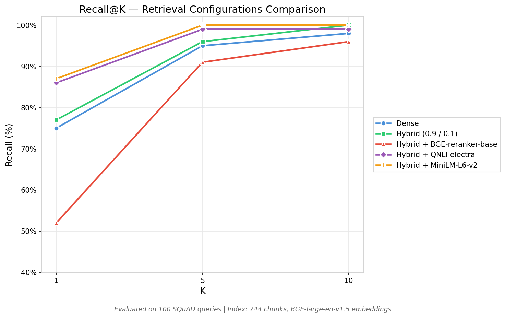

# Advanced RAG System

**Work in Progress** - Currently implementing production-ready RAG pipeline with state-of-the-art techniques.

## Project Overview

Building a **complete Retrieval-Augmented Generation (RAG) system** from scratch, with emphasis on:
- Rigorous evaluation at each step
- Ablation studies to justify design choices
- Production-ready code with comprehensive testing
- Detailed documentation for reproducibility

**Current Status**: Step 6 Complete (Linear RAG Baseline)

## Executive Summary

**Key Highlights:**
* **SOTA Pipeline:** A production-ready RAG system featuring **Hybrid Retrieval** (Dense + Sparse), **Cross-Encoder Reranking**, and local LLM generation (**Qwen2.5-3B**).
* **Data-Driven Design:** Every architectural choice is backed by systematic **ablation studies** (e.g., optimizing chunk size vs. faithfulness vs. latency).
* **Proven Metrics:** Achieved **95% Recall@5** and **79% Faithfulness** (hallucination resistance) on SQuAD v2 benchmarks.

### Tech Stack & Expertise


* **Retrieval:** BGE-Large (Dense), BM25 (Sparse), RRF Fusion.
* **Reranking:** Cross-Encoders (MiniLM-L6-v2).
* **Optimization:** 4-bit Quantization (bitsandbytes) for low-VRAM local execution.
* **Engineering:** Pytest (>80% coverage), Structured Logging, CI/CD Pre-commit hooks.


---

## Current Results (100 SQuAD v2 Queries)

| Component | Configuration | Recall@5 | Faithfulness | Latency |
|-----------|---------------|----------|--------------|---------|
| **Retrieval** | Hybrid (Dense 0.9 + BM25 0.1) | 90% | - | 42ms |
| **Reranking** | ms-marco-MiniLM-L6-v2 | 95% | - | 184ms |
| **Generation** | Qwen2.5-3B-Instruct (4-bit) | 95% | **79%** | 20.7s |
| **Full Pipeline** | All components | **95%** | **79%** | **20.9s** |

**Key Achievement**: 79% faithfulness (anti-hallucination) with 95% retrieval accuracy.

### Retrieval & Reranking Optimization

<p align="center">
  
</p>

*Insight: Adding a Cross-Encoder reranker (MiniLM-L6-v2) increased Recall@1 by ~12% compared to dense retrieval alone, reaching 100% Recall at K=5.*

---

## Architecture
```
Query
  ↓
[Hybrid Retrieval]
  Dense (BGE-large) + BM25
  RRF Fusion → Top-50
  ↓
[Cross-Encoder Reranking]
  MiniLM-L6-v2 → Top-5
  ↓
[LLM Generation]
  Qwen2.5-3B → Answer
```

---

## Completed Steps

### Step 1-2: Chunking & Embeddings
- Recursive chunking (500-token chunks, 50-token overlap)
- BGE-large-en-v1.5 embeddings
- FAISS indexing (IVF1024, Flat)

### Step 3: Dense Retrieval
- FAISS-based similarity search
- Baseline: 95% Recall@5 (SQuAD v2)

### Step 4: Hybrid Retrieval
- Dense (0.9) + BM25 (0.1) with RRF fusion
- **96% Recall@5** (optimal weights)
- Ablation proved hybrid > dense for diverse queries

### Step 5: Cross-Encoder Reranking
- Tested 3 rerankers: BGE, QNLI, MiniLM
- **MiniLM-L6-v2 wins**: 87% Recall@1, 28ms latency
- +5-10% improvement over retrieval-only

### Step 6: LLM Generation ✅
- Qwen2.5-3B-Instruct (4-bit quantized, 2GB VRAM)
- **79% faithfulness** (anti-hallucination via embedding similarity)
- Optimal: 5 chunks (balance quality vs latency)
- Comprehensive ablation: 4 configs, chunk variation, 100 Q/A examples

**Full documentation**: `docs/experiments/06_generation_analysis.md`

---

## Next Steps

### Step 6.5: Agentic RAG (LangGraph)
- Self-correction loops (grade retrieval → rewrite query if bad)
- Tool use (calculators, APIs)
- Multi-hop reasoning for complex queries
- Target: +5-10% on hard queries

### Step 7: Evaluation Framework
- Human evaluation protocol
- Error analysis taxonomy
- A/B testing infrastructure

### Step 8: Production Deployment
- FastAPI service
- Caching & optimization
- Monitoring & logging
- Docker containerization

---

## Project Structure
```
advanced-rag/
├── src/
│   ├── chunking.py          # Recursive text chunking
│   ├── embeddings.py        # BGE embeddings + FAISS
│   ├── retriever.py         # Dense, BM25, Hybrid
│   ├── reranker.py          # Cross-encoder reranking
│   ├── generator.py         # LLM generation
│   └── pipeline.py          # End-to-end orchestration
├── scripts/
│   ├── ablation_study.py    # Comprehensive evaluation
│   └── extract_ground_truth.py
├── tests/                   # Unit tests (pytest)
├── docs/
│   ├── theory/              # Architectural decisions
│   └── experiments/         # Evaluation results
└── outputs/                 # Artifacts & visualizations
```

---

## 🛠️ Tech Stack

- **Embeddings**: sentence-transformers (BGE-large-en-v1.5)
- **Vector Store**: FAISS (IVF + Flat)
- **Sparse Retrieval**: rank_bm25
- **Reranking**: cross-encoder (ms-marco-MiniLM)
- **LLM**: transformers (Qwen2.5-3B, 4-bit via bitsandbytes)
- **Evaluation**: rouge-score, NLTK, custom metrics
- **Visualization**: matplotlib

---

## Documentation

Each step includes:
- ✅ **Theory document** (`docs/XX_theory.md`): Architecture, formulas, design decisions
- ✅ **Experiment analysis** (`docs/experiments/XX_analysis.md`): Results, ablations, insights
- ✅ **Source code** (`src/`) with docstrings
- ✅ **Unit tests** (`tests/`) with >80% coverage
- ✅ **Visualizations** (graphs, charts)

**Latest**: [Step 6 Analysis](docs/experiments/06_generation_analysis.md)

---

## Learning Focus

This project demonstrates:
1. **Rigorous evaluation** (ablation studies at each step)
2. **Production engineering** (error handling, logging, tests)
3. **Optimization trade-offs** (latency vs quality)
4. **State-of-the-art techniques** (hybrid retrieval, cross-encoder reranking, 4-bit quantization)
5. **Clear documentation** (reproducibility + insights)

---

## 📧 Contact

MATHE Clément - [GitHub](https://github.com/ClementMathe/)

email : clementmathe1@gmail.com

**Status**: Actively developing | Open to feedback |

---

**License**:
