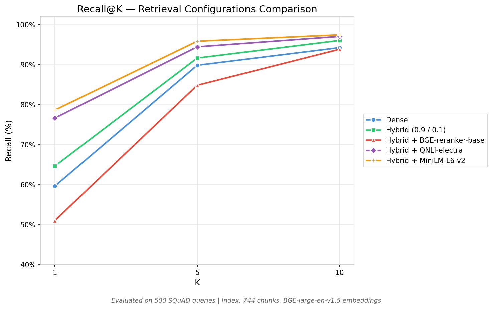
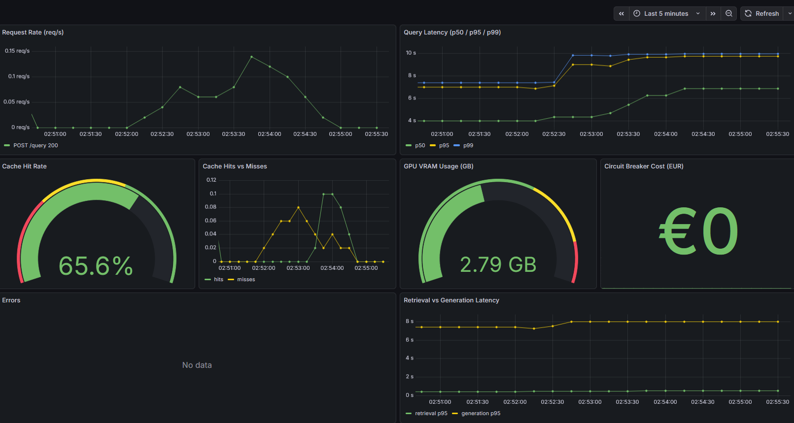

# Advanced RAG System


End-to-end RAG system built from scratch: hybrid retrieval, cross-encoder reranking, agentic orchestration (LangGraph), rigorous statistical evaluation, and containerized production deployment.

**Highlights:**
- **96% Recall@5**: dense (BGE-large) + sparse (BM25) hybrid retrieval with RRF fusion, +6 pp over dense-only
- **+14pp Recall@1**: cross-encoder reranking (ms-marco-MiniLM-L6-v2) selected over 3 reranker ablations (500 queries)
- **-18% latency**: LangGraph adaptive pipeline skips reranking when top-1 retrieval score exceeds threshold
- **Evaluation framework**: automated F1/BERTScore/faithfulness, A/B testing (Mann-Whitney U), 500-query SQuAD benchmark
- **Production API**: FastAPI + Redis semantic cache + circuit breaker + Prometheus/Grafana, one-command Docker Compose

---

## Try it

**Streamlit demo** (local, no server needed):
```bash
# Build the SQuAD index first (~5 min)
python scripts/prepare_squad.py && python scripts/build_index.py

# Launch
pip install -r requirements.txt
streamlit run streamlit_app.py
```

**Production API** (Docker):
```bash
docker-compose up -d
# REST API + Swagger: http://localhost:8000/docs
# Grafana dashboard:  http://localhost:3000
```

Three pipeline modes (Linear / Adaptive / Agentic), local Qwen or Mistral API generators:


> **No GPU?** Use Mistral Small/Large in the sidebar, no local model needed, ~300 ms/query.

---

## Key Results

### Pipeline evolution (SQuAD v2, 100 queries)

| Step | Component added | Recall@5 | Faithfulness | Latency |
|------|----------------|----------|--------------|---------|
| 3 | Dense retrieval (BGE-large) | 90% | - | 38 ms |
| 4 | + BM25 hybrid (RRF) | 92% | - | 42 ms |
| 5 | + Cross-encoder reranking | **96% @5** (+14pp R@1) | - | 226 ms |
| 6 | + Qwen 2.5-3B (4-bit) | 96% | 79% | 20.9 s |
| 6.5 | + Adaptive retrieval (LangGraph) | 95% | **+5.6% faithfulness** | **17.3 s** (-18%) |



---

## Architecture

### Linear pipeline
```
Query
  ↓
[Hybrid Retrieval]         BGE-large (dense) + BM25 (sparse)
  RRF fusion → Top-50      dense_weight=0.9, sparse_weight=0.1
  ↓
[Cross-Encoder Reranking]  ms-marco-MiniLM-L6-v2 → Top-5
  ↓
[LLM Generation]           Qwen 2.5-3B (local) or Mistral API
  ↓
Answer
```

### Agentic pipeline (LangGraph)
```
Query
  ↓
[Hybrid Retrieval + Reranking]
  ↓
[Document Grader] ─── irrelevant docs filtered ──→ [Query Rewriter]
  ↓                                                        ↓
[Generation]                                       [Re-retrieve]
  ↓
[Answer Grader] ─── not acceptable ──→ retry (max 1)
  ↓
Answer  (+  used_web_search / used_fallback flags)
```

### Production API layer (Step 8)
```
Client -> [FastAPI] -> [Semantic Redis Cache] -> [RAG Pipeline]
                  |                          |
           [Prometheus]              [Circuit Breaker]
                  |
           [Grafana Dashboard]
```



---

## Completed Steps

| Step | Focus | Key outcome |
|------|-------|-------------|
| 1–2 | Chunking + embeddings | 500-token recursive chunks, BGE-large FAISS (IVF1024) |
| 3 | Dense retrieval | 90% Recall@5, FAISS cosine similarity |
| 4 | Hybrid retrieval | 96% Recall@5, RRF fusion (Dense 0.9 + BM25 0.1) |
| 5 | Cross-encoder reranking | +12% Recall@1 (MiniLM-L6 wins over BGE/QNLI) |
| 6 | LLM generation | 79% faithfulness, Qwen 2.5-3B 4-bit, 100-query ablation |
| 6.5 | Agentic RAG (LangGraph) | +5.5% F1, −18% latency via adaptive retrieval |
| 7 | Evaluation framework | MetricsCalculator, A/B testing, error taxonomy, human eval protocol |
| 8 | Production deployment | FastAPI + Redis + Prometheus + Grafana, Docker Compose |

---

## Project Structure

```
advanced-rag/
├── streamlit_app.py          # Interactive demo (Linear / Adaptive / Agentic)
│
├── src/
│   ├── chunking.py           # Recursive text chunking
│   ├── embeddings.py         # BGE embeddings + FAISS (IVF/Flat)
│   ├── retriever.py          # Dense, BM25, HybridRetriever (RRF)
│   ├── reranker.py           # Cross-encoder reranking
│   ├── generator.py          # LLMGenerator (Qwen, 4-bit)
│   ├── graders.py            # DocumentGrader, AnswerGrader, QueryRewriter
│   ├── agentic_pipeline.py   # AgenticRAGPipeline (LangGraph)
│   ├── pipeline.py           # RAGPipeline (linear)
│   ├── mistral_generator.py  # MistralAPIGenerator (drop-in, exponential backoff)
│   ├── mistral_grader.py     # MistralDocumentGrader/AnswerGrader (function calling)
│   ├── api/                  # FastAPI production service (12 modules)
│   └── evaluation/           # Metrics, A/B testing, error taxonomy, human eval
│
├── scripts/                  # Evaluation scripts (ablations, benchmarks)
├── tests/                    # 601 unit + integration tests
├── docs/
│   ├── theory/               # 8 theory docs (chunking → production deployment)
│   └── experiments/          # 8 experiment analyses with concrete results
├── outputs/                  # JSON results + plots from all experiments
├── assets/                   # Visualizations
├── Dockerfile
└── docker-compose.yml        # RAG API + Redis + Prometheus + Grafana
```

---

## Tech Stack

| Layer | Technology |
|-------|-----------|
| Embeddings | sentence-transformers (BGE-large-en-v1.5) |
| Vector store | FAISS (IVF1024 + Flat) |
| Sparse retrieval | rank-bm25 |
| Reranking | cross-encoder/ms-marco-MiniLM-L6-v2 |
| Local LLM | Qwen 2.5-3B-Instruct (4-bit, bitsandbytes) |
| Cloud LLM | Mistral Small / Large (mistralai SDK) |
| Agentic orchestration | LangGraph |
| Production API | FastAPI + Uvicorn |
| Cache | Redis (semantic similarity cache) |
| Observability | Prometheus + Grafana |
| Containerization | Docker + Docker Compose |
| Testing | pytest (601 tests, >85% coverage) |
| CI | pre-commit hooks (black, flake8, mypy) |

---

## Documentation

Each step has three documents:

| Step | Theory | Experiment Analysis |
|------|--------|---------------------|
| Chunking | [01_chunking_theory.md](docs/theory/01_chunking_theory.md) | [step2_chunking_analysis.md](docs/experiments/step2_chunking_analysis.md) |
| Embeddings | [02_embeddings_theory.md](docs/theory/02_embeddings_theory.md) | [step3_embeddings_analysis.md](docs/experiments/step3_embeddings_analysis.md) |
| Hybrid retrieval | [03_hybrid_retrieval_theory.md](docs/theory/03_hybrid_retrieval_theory.md) | [step4_hybrid_analysis.md](docs/experiments/step4_hybrid_analysis.md) |
| Reranking | [04_reranking_theory.md](docs/theory/04_reranking_theory.md) | [step5_reranking_analysis.md](docs/experiments/step5_reranking_analysis.md) |
| Generation | [05_generation_theory.md](docs/theory/05_generation_theory.md) | [step6_generation_analysis.md](docs/experiments/step6_generation_analysis.md) |
| Agentic RAG | [06_agentic_theory.md](docs/theory/06_agentic_theory.md) | [step6.5_agentic_analysis.md](docs/experiments/step6.5_agentic_analysis.md) |
| Evaluation | [07_evaluation_theory.md](docs/theory/07_evaluation_theory.md) | [step7_evaluation_analysis.md](docs/experiments/step7_evaluation_analysis.md) |
| Deployment | [08_production_deployment_theory.md](docs/theory/08_production_deployment_theory.md) | [step8_deployment_analysis.md](docs/experiments/step8_deployment_analysis.md) |

---

## What's next

**Step 9 - Mistral integration (in progress):** Generator comparison (Qwen vs Mistral Small/Large, n=20 SQuAD), function-calling document and answer graders, HotpotQA multi-hop benchmark (n=200, configs A-E complete). Remaining experiments paused pending API credits.

Two directions under consideration:
- **Semantic chunking**: late chunking / proposition-level splitting to improve multi-hop reasoning — HotpotQA results show the fixed-size chunker as the bottleneck, not the retriever
- **Streaming responses**: FastAPI SSE endpoint + Streamlit `st.write_stream` for perceived latency improvement on slow local generation

---

## Contact

**Clément Mathé** | [GitHub](https://github.com/ClementMathe/) | clementmathe1@gmail.com
