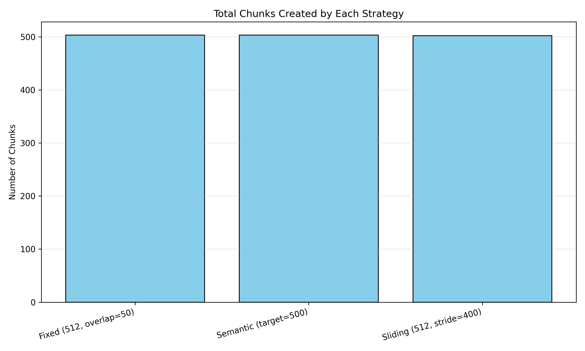
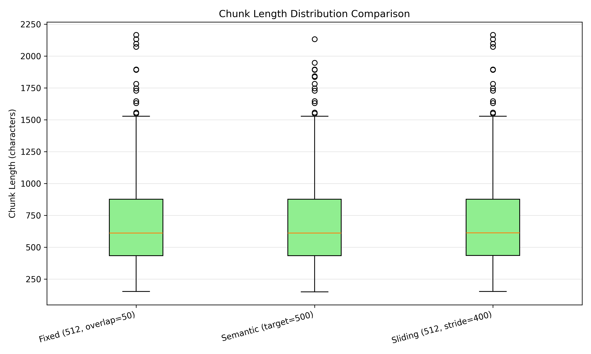
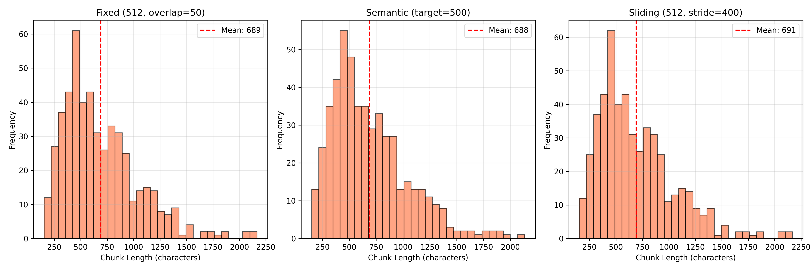
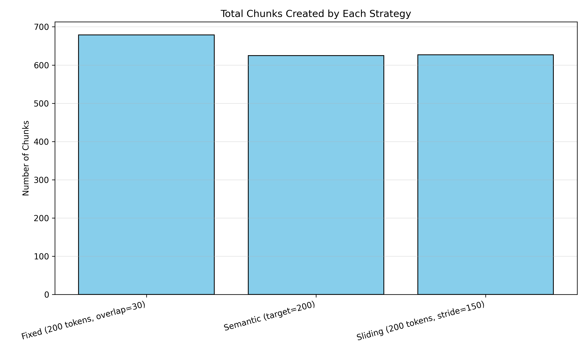
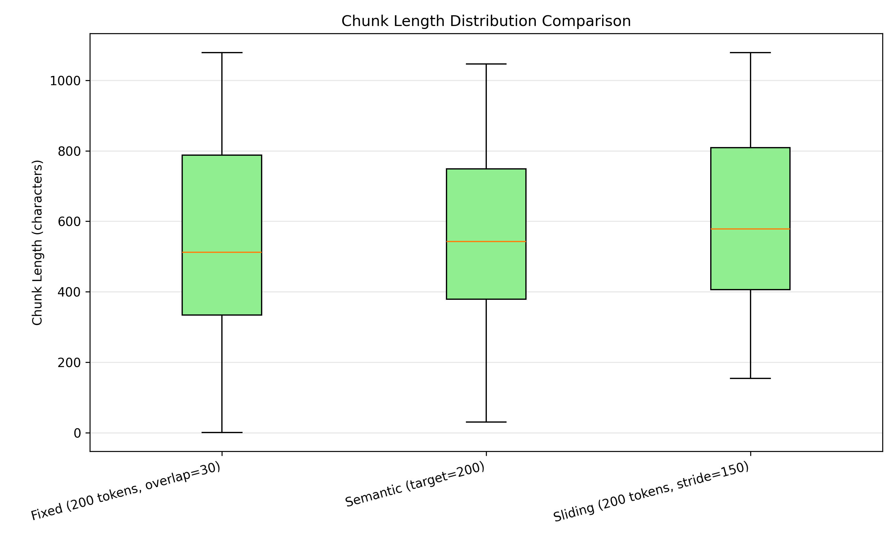
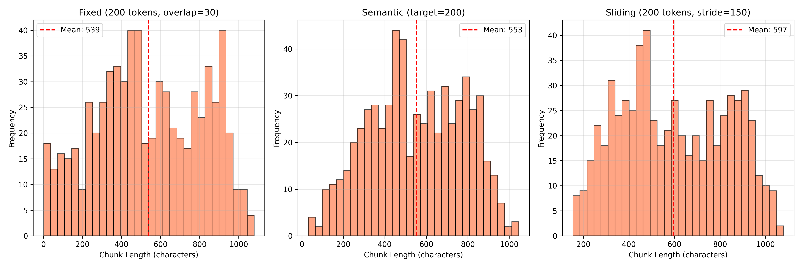

# Step 2: Chunking Analysis - Experimental Results

## Overview

This document summarizes the experimental analysis conducted during Step 2 of the Advanced RAG project. We compared three chunking strategies on the SQuAD 2.0 dataset to understand their behavior and trade-offs.

---

## Dataset Characteristics

### SQuAD 2.0 Preparation Results

**Command**: `python scripts/prepare_squad.py --sample_size 5000`

```
Downloaded: 130,319 examples (full train split)
Processed: 5,000 examples
Created: 741 unique documents
```

**Why 741 documents from 5000 examples?**

SQuAD 2.0 contains multiple questions per context paragraph. The dataset structure is:
- **Context** (paragraph): Shared across multiple questions
- **Question**: Specific question about the context
- **Answer**: Answer span within the context

**Example**:
```
Context: "Paris is the capital of France. It is located on the Seine River..."

Question 1: "What is the capital of France?"
Question 2: "Where is Paris located?"
Question 3: "What river runs through Paris?"
```

**Result**: 3 examples → 1 document (we deduplicate contexts)

This is optimal because:
1. ✅ No redundancy in the index (same context not embedded multiple times)
2. ✅ Faster indexing and search
3. ✅ Realistic scenario (documents are the retrieval unit, not Q/A pairs)


### Why only 5000 examples instead of full SQuAD?

**Reasons**:
1. **Deduplication**: 5000 examples → ~741 unique contexts
   - Full dataset (130k examples) → ~20k unique contexts
   - Diminishing returns after enough variety

2. **Training efficiency**:
   - 741 docs process in <1 minute
   - 20k docs would take 10-15 minutes
   - Good for rapid iteration during development

3. **Representativeness**:
   - Sample includes diverse topics (11 unique titles observed)
   - Statistics stable after ~500 documents
   - Adding more doesn't change conclusions

4. **Index size**:
   - 741 docs → ~500 chunks (manageable for testing)
   - 20k docs → ~15k chunks (production-scale)
   - Can always increase later for final evaluation

**When to use full dataset**:
- Final evaluation and benchmarking
- Production deployment
- Publishing results

**For learning/iteration**: 1000-5000 examples is optimal.

### Document Statistics

```
Total documents: 741
Average length: 706.1 chars (114.3 words)
Length range: 154 - 3076 chars
Documents with answers: 100.0%
Unique titles: 11
```

**Key Insight**: Most documents are ~700 chars, which is **perfect for single-chunk retrieval** with typical chunk sizes (512-768 tokens).

---

## Experiment 1: Standard Chunk Sizes (512 tokens)

### Configuration

```python
strategies = {
    "Fixed (512, overlap=50)": FixedSizeChunker(chunk_size=512, overlap=50),
    "Semantic (target=500)": SemanticChunker(target_size=500, min_size=100, max_size=1000),
    "Sliding (512, stride=400)": SlidingWindowChunker(window_size=512, stride=400)
}
```

**Documents tested**: 500

### Results

<div style="display: flex; gap: 10px; justify-content: center; align-items: center;">
    
    
</div>

<div style="display: flex; justify-content: center; margin-top: 20px;">
    
</div>

<br>

<table style="text-align: center; margin-left: auto; margin-right: auto; border-collapse: collapse;">
  <thead>
    <tr>
      <th>Strategy</th>
      <th>Total Chunks</th>
      <th>Avg Length (chars)</th>
      <th>Min</th>
      <th>Max</th>
      <th>Std Dev</th>
    </tr>
  </thead>
  <tbody>
    <tr>
      <td>Fixed (512, overlap=50)</td><td>503</td><td>689.1</td><td>154</td><td>2166</td><td>356.2</td>
    </tr>
    <tr>
      <td>Semantic (target=500)</td><td>503</td><td>687.9</td><td>150</td><td>2132</td><td>351.6</td>
    </tr>
    <tr>
      <td>Sliding (200, stride=150)</td><td>502</td><td>690.9</td><td>154</td><td>2166</td><td>356.0</td>
    </tr>
  </tbody>
</table>


### Analysis

**Observation**: All three strategies produce **nearly identical results**.

**Why?**
1. **Document size matches chunk size**: Average doc (706 chars) ≈ target (512 tokens ≈ 650-750 chars)
2. **No splitting needed**: Most documents fit in a single chunk
3. **Chunks per document**: `503 chunks / 500 docs ≈ 1.01 chunks/doc`

**Interpretation**:
- SQuAD contexts are already well-sized for RAG
- Chunking strategy matters less when docs are pre-optimized
- Only very long documents (>1000 chars) get split

**Conclusion**: For this dataset with these parameters, **all strategies are equivalent**.

---

## Experiment 2: Small Chunk Sizes (200 tokens)

### Configuration

```python
strategies = {
    "Fixed (200, overlap=30)": FixedSizeChunker(chunk_size=200, overlap=30),
    "Semantic (target=200)": SemanticChunker(target_size=200, min_size=50, max_size=400),
    "Sliding (200, stride=150)": SlidingWindowChunker(window_size=200, stride=150)
}
```

**Documents tested**: 500

### Results

<div style="display: flex; gap: 10px; justify-content: center; align-items: center;">
    
    
</div>

<div style="display: flex; justify-content: center; margin-top: 20px;">
    
</div>

<br>

<table style="text-align: center; margin-left: auto; margin-right: auto; border-collapse: collapse;">
  <thead>
    <tr>
      <th>Strategy</th>
      <th>Total Chunks</th>
      <th>Avg Length (chars)</th>
      <th>Min</th>
      <th>Max</th>
      <th>Std Dev</th>
    </tr>
  </thead>
  <tbody>
    <tr>
      <td>Fixed (200, overlap=30)</td><td>679</td><td>539.1</td><td>1</td><td>1079</td><td>273.9</td>
    </tr>
    <tr>
      <td>Semantic (target=200)</td><td>625</td><td>553.4</td><td>31</td><td>1046</td><td>225.9</td>
    </tr>
    <tr>
      <td>Sliding (200, stride=150)</td><td>627</td><td>596.5</td><td>154</td><td>1079</td><td>233.6</td>
    </tr>
  </tbody>
</table>


### Analysis

**Now we see differences!**

| Strategy | Chunk Count | Size Variance (std) | Average Length (chars) | Notes / Insight |
|----------|-------------|-------------------|----------------------|----------------|
| **Fixed** | 679 chunks (highest)<br>- Rigid splitting, even mid-sentence<br>- More fragmentation | 273.9<br>- Some chunks very short (1 char)<br>- Unpredictable sizes | 539.1<br>- Strict enforcement of token limit<br>- Cuts wherever needed | Creates +8% more chunks due to arbitrary splitting |
| **Semantic** | 625-627 chunks<br>- Respects sentence boundaries → fewer splits | 225.9<br>- Keeps complete sentences<br>- More consistent semantic units | 553.4<br>- Respects natural boundaries<br>- Slightly larger to preserve coherence | Produces more predictable chunk sizes |
| **Sliding** | 625-627 chunks<br>- Overlap compensates for stride → similar net result | 233.6<br>- Slightly higher than Semantic<br>- Overlap ensures coverage, still predictable | 596.5<br>- Window + overlap includes repeated content<br>- Redundancy increases average | Overlap creates longer effective chunks |

---

## Key Findings

### 1. Dataset Impact on Chunking

**SQuAD 2.0 is pre-optimized for QA**:
- Contexts are already ~700 chars (optimal for single retrieval)
- Well-structured paragraphs with complete thoughts
- No need for aggressive chunking

**Implication**: For similar QA datasets, simple strategies work well.

### 2. Chunk Size vs Strategy Importance

| Chunk Size | Strategy Impact | Recommendation |
|------------|----------------|----------------|
| **Large (≥512 tokens)** | Minimal | Fixed chunking sufficient |
| **Medium (256-512 tokens)** | Moderate | Semantic if structure exists |
| **Small (≤200 tokens)** | High | Semantic or Sliding critical |

<br>

**Rule of thumb**: The smaller the chunks, the more strategy matters.

### 3. Trade-offs Observed

| Strategy | Pros | Cons |
|----------|------|------|
| **Fixed-Size Chunking** | - Predictable chunk count<br>- Fast processing<br>- Simple implementation | - Breaks sentences/paragraphs<br>- High variance with small chunks<br>- Loses semantic coherence |
| **Semantic Chunking** | - Preserves complete thoughts<br>- Lower variance<br>- Better for human readability | - Fewer chunks (lower recall potential)<br>- Variable sizes complicate batch processing<br>- Requires sentence detection |
| **Sliding Window** | - Maximum coverage (no gaps)<br>- Consistent sizes<br>- Robust to boundary issues | - High redundancy (storage overhead)<br>- More chunks to search (slower retrieval)<br>- Potential duplicate results |

---

## Practical Recommendations

| Use Case | Recommended Strategy | Why | Benefit |
|----------|--------------------|-----|--------|
| SQuAD-like QA Datasets | Fixed chunking (512 tokens, overlap=50) | Documents are already well-sized | Simple, fast, effective |
| Long-form Content (Books, Papers) | Sliding window (512 tokens, stride=400) | Ensures no information lost at boundaries | Robust retrieval across chunk edges |
| Technical Documentation | Semantic chunking (target=500, min=200, max=1000) | Respects code blocks, sections, headings | Each chunk is a complete concept |
| Unstructured Text (Transcripts, OCR) | Fixed chunking (256-512 tokens, overlap=20%) | No natural structure to preserve | Speed over quality |


---


## Conclusions

1. **Dataset matters more than strategy** (for this use case)
   - SQuAD is pre-optimized → strategies converge
   - For unstructured data, strategy choice is critical

2. **Chunk size is the primary tuning parameter**
   - Large chunks (512+): Strategy-agnostic
   - Small chunks (≤256): Strategy matters significantly

3. **Trade-offs are real**:
   - Precision vs Recall
   - Speed vs Quality
   - Storage vs Coverage

4. **No universal best**:
   - Fixed: Best for speed and simplicity
   - Semantic: Best for quality and coherence
   - Sliding: Best for coverage and robustness


---

**Date**: December 17, 2025
**Scripts used**: `prepare_squad.py`, `compare_chunking.py`
