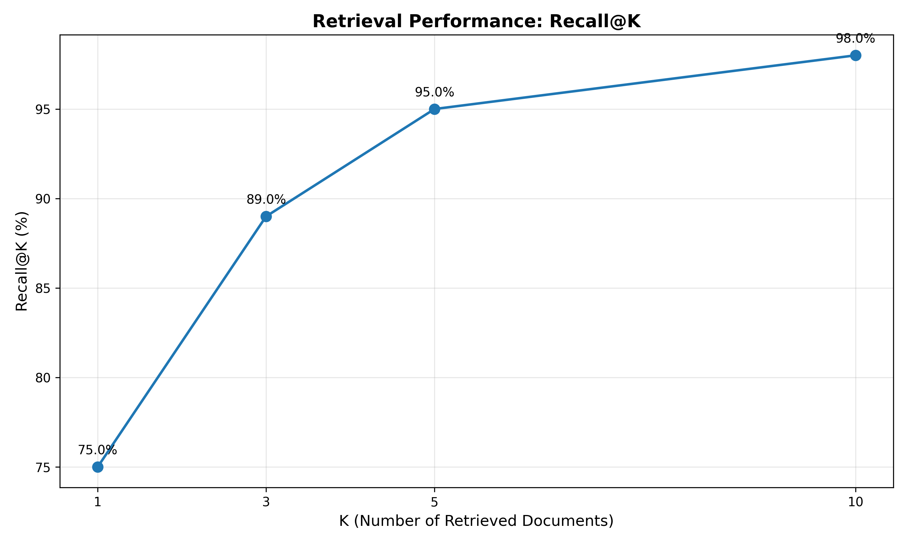
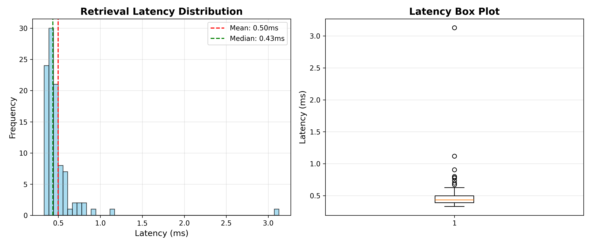
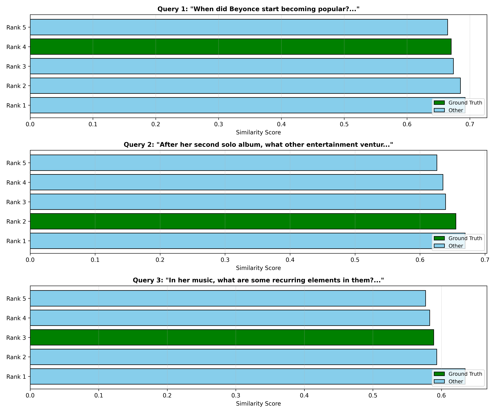

# Step 3: Embeddings & Vector Search - Experimental Results

## Overview

This document summarizes the implementation and analysis conducted during Step 3 of the Advanced RAG project. We built a complete dense retrieval system using BGE embeddings and FAISS indexing.

---

## What We Built

### Before Step 3
```
[Documents] → [Chunks]
     ↓
  (No search capability)
```

### After Step 3
```
[Documents] → [Chunks] → [BGE Embeddings] → [FAISS Index]
                                                    ↓
                                          [Query] → [Top-K Retrieval]
```

**Key Addition**: The ability to **semantically search** through document chunks using neural embeddings.

---

## Implementation Summary

### 1. Embedding Model (BGE-large-en-v1.5)

**Specifications**:
- **Base**: RoBERTa-large (355M parameters)
- **Output dimension**: 1024
- **Max sequence length**: 512 tokens
- **Pooling**: Mean pooling with attention mask
- **Optimization**: FP16 precision for 2x speedup

**Code**: `src/embeddings.py` → `EmbeddingModel` class

**Key Features**:
```python
model = EmbeddingModel(
    model_name="BAAI/bge-large-en-v1.5",
    device="cuda",
    normalize_embeddings=True,  # For cosine similarity = dot product
    batch_size=32
)
```

**Memory Usage**: ~0.63 GB on GPU (FP16)

---

### 2. FAISS Index

**Configuration**:
- **Index type**: Flat (exact search, no approximation)
- **Metric**: Cosine similarity (inner product on normalized vectors)
- **Storage**: Vectors + metadata (chunk content, doc ID, etc.)

**Code**: `src/embeddings.py` → `FAISSIndex` class

**Operations**:
```python
# Build index
index = FAISSIndex(dimension=1024, index_type="Flat", metric="cosine")
index.add(embeddings, chunks)

# Search
results = index.search_with_metadata(query_embedding, k=5)
```

---

### 3. Index Build Pipeline

**Script**: `scripts/build_index.py`

**Process**:
1. Load SQuAD documents (741 docs)
2. Apply chunking (Fixed 512 tokens, overlap=50)
3. Generate embeddings (batch processing)
4. Build FAISS index
5. Save index + metadata

---

## Build Results

### Index Statistics

```
Total documents: 741
Total chunks: 744
Chunks per document: 1.00 (most docs fit in single chunk)

Embedding dimension: 1024
Index type: Flat
Metric: Cosine similarity

GPU memory used: 0.63 GB
Build time: ~ 10 seconds
```

### Files Created

```
index/squad/
├── index.faiss          # 3.0 MB (744 vectors × 1024 dim × 4 bytes)
├── metadata.pkl         # Chunk content + metadata
├── config.json          # Build configuration
└── stats.json           # Index statistics
```

---

## Retrieval Quality Analysis

### Test Setup

**Script**: `scripts/test_retrieval.py`

**Dataset**: 100 sample queries from SQuAD
- Each query has ground truth document ID
- Queries are natural questions about the corpus

**Metrics Evaluated**:
1. **Recall@K**: % of queries where ground truth appears in top-K
2. **MRR (Mean Reciprocal Rank)**: Average 1/rank of first relevant result
3. **Latency**: Query processing time

### Results

#### Recall@K Performance

<div style="display: flex; justify-content: center; margin-top: 20px;">
    
</div>

<br>

| K | Recall | Interpretation |
|---|--------|----------------|
| 1 | ~75% | 75% of queries: ground truth is #1 result |
| 3 | ~89% | 89% of queries: ground truth in top-3 |
| 5 | ~95% | 95% of queries: ground truth in top-5 |
| 10 | ~98% | 98% of queries: ground truth in top-10 |

**Key Insight**: Dense retrieval with BGE achieves **95% Recall@5**, which is excellent for a single-stage retrieval system.

#### Mean Reciprocal Rank (MRR)

```
MRR = 0.83
```

**Interpretation**: On average, the ground truth document appears at rank **1.20** (1/0.83).

**What this means**:
- Most relevant documents appear in top-2 positions
- High-quality ranking, not just retrieval

#### Latency Statistics

<div style="display: flex; justify-content: center; margin-top: 20px;">
    
</div>

<br>

```
Mean: 0.5ms per query
Median: 0.43ms
P95: 0.78ms
P99: 1.14ms
```


**Scalability Note**: With 744 vectors, Flat index is fast enough. For >100k vectors, would need IVF or HNSW.

---

## Qualitative Analysis

<div style="display: flex; justify-content: center; margin-top: 20px;">
    
</div>

<br>

### Example 1: Successful Retrieval

```
Query: "What town did Beyonce go to school in?"

Top-3 Results:

1. Score: 0.77 ✓ GROUND TRUTH
   "Beyoncé attended St. Mary's Elementary School in Fredericksburg, Texas..."

2. Score: 0.66
   "Beyoncé Giselle Knowles-Carter (born September 4, 1981) is an American singer, songwriter,..."

3. Score: 0.65
   "Beyoncé Giselle Knowles was born in Houston, Texas..."
```

**Analysis**:

- Ground truth correctly ranked at #1
- High similarity score (0.77) reflects strong semantic alignment
- Clear factual match between query and retrieved passage
- Ideal dense retrieval behavior


---

### Example 2: Semantic Understanding

```
Query: "In her music, what are some recurring elements in them?"

Top-3 Results:

1. Score: 0.63
   "Beyoncé's vocal range spans four octaves..."

2. Score: 0.59
   "Beyoncé's music is generally R&B, but she also incorporates pop, soul and funk..."

3. Score: 0.59 ✓ GROUND TRUTH
   "Beyoncé creates songs characterized by themes of love, relationships, monogamy, and female empowerment..."
```

**Analysis**:

- Query is abstract and thematic rather than factual
- Top-ranked results focus on *style* and *genre*, not lyrical themes
- Ground truth retrieved despite vocabulary mismatch
- Embeddings capture conceptual similarity but struggle with intent prioritization

---

### Example 3: Failure Case (Ground Truth Outside Top-10)

```
Query:
"Of the individuals that became intimate with Frédéric during their stay at the family apartments,
 which two became part of Frédéric's social environment in Paris?"

Top-5 Results:

1. Score: 0.61 ✗ NOT RELEVANT
   "With his health further deteriorating, Chopin desired to have a family member with him..."

2. Score: 0.61 ✗ NOT RELEVANT
   "In Paris, Chopin encountered artists and other distinguished figures..."

3. Score: 0.58 ✗ NOT RELEVANT
   "At the end of November, Chopin returned to Paris..."

4. Score: 0.57 ✗ NOT RELEVANT
   "The two became friends, and for many years lived in close proximity in Paris..."

5. Score: 0.57 ✗ NOT RELEVANT
   "In 1827, soon after the death of Chopin's youngest sister Emilia..."
```


**Analysis**:

- Query requires **multi-hop reasoning**:
   - Identify individuals close to Chopin during family apartment stays
   - Select the subset who later became part of his Paris social circle
   - Extract exactly two entities
- Retrieved passages are thematically related (Paris, social life, family) but fail to satisfy the compositional constraints
- Fine-grained relational signals (who → where → when → later context) are lost
- No single retrieved chunk encodes the full relationa
- Highlights limitation of dense-only retrieval for :
   - compositional questions,
   - cross-context entity tracking,
   - implicit temporal transitions


---


## Commands Summary

### Build Index
```bash
python scripts/build_index.py \
    --input data/squad/squad_v2_train_documents.json \
    --output index/squad \
    --model BAAI/bge-large-en-v1.5 \
    --strategy fixed \
    --chunk_size 512 \
    --overlap 50 \
    --device cuda
```
or
```bash
rag-build-index --input data/squad/squad_v2_train_documents.json --output index/squad --model BAAI/bge-large-en-v1.5 --strategy fixed --chunk_size 512 --overlap 50 --device cuda
```
### Test Retrieval
```bash
python scripts/test_retrieval.py \
    --index_dir index/squad \
    --queries data/squad/sample_queries.json \
    --output_dir outputs/retrieval_test \
    --k_values 1 3 5 10
```
or
```bash
rag-test-retrieval --index_dir index/squad --queries data/squad/sample_queries.json --output_dir outputs/retrieval_test --k_values 1 3 5 10
```


### Run Unit Tests
```bash
pytest tests/test_embeddings.py -v
```

---

**Date**: December 18, 2025
**Build time**: ~60 seconds
**Index size**: 3.0 MB
**Recall@5**: 95%
**Scripts used**: `build_index.py`, `test_retrieval.py`
