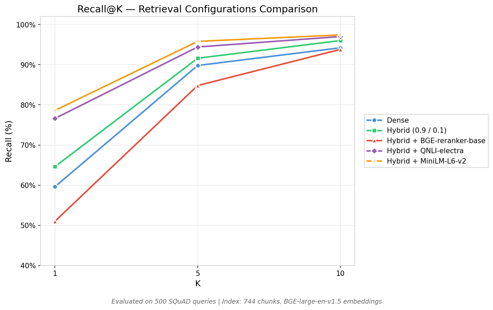
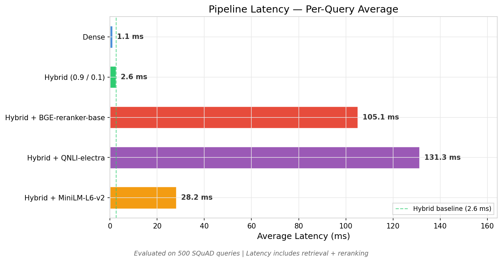

# Step 5: Cross-Encoder Re-ranking — Analysis

## Overview

This step adds a cross-encoder re-ranking stage after hybrid retrieval. Once the hybrid retriever returns its top-20 candidates, a cross-encoder model independently scores every (query, document) pair, producing a more accurate relevance ordering than the initial retrieval scores alone.

The central finding of this step is that **re-ranker model selection is the dominant variable**. A poorly matched model actively degrades results; a well-matched one delivers consistent gains across every metric.

---

## Pipeline Architecture

```
Documents → Chunking → BGE-large Embeddings → FAISS Index
                                                   │
                                                   ▼
                                 Hybrid Retrieval (Dense 0.9 + BM25 0.1 + RRF)
                                 Returns top-20 candidates
                                                   │
                                                   ▼
                                 Cross-Encoder Re-ranking          ← This step
                                 Scores all 20 candidates
                                 Returns top-10 final results
                                                   │
                                                   ▼
                                           LLM Generation (Step 6)
```

---

## Experimental Setup

### Fixed Parameters

All configurations share identical parameters to ensure a fair comparison.

| Parameter | Value | Rationale |
|-----------|-------|-----------|
| `k_retriever` | 50 | Dense and sparse candidates fetched before RRF fusion |
| `k_candidates` | 20 | Documents forwarded to the cross-encoder |
| `k_final` | 10 | Results returned after re-ranking |
| `max_length` | 512 tokens | Cross-encoder input ceiling |
| Hybrid weights | 0.9 dense / 0.1 sparse | Optimised in Step 4 |

### Models Evaluated

| Model | Parameters | Training Data | Output Format |
|-------|-----------|---------------|---------------|
| BAAI/bge-reranker-base | 278M | MS MARCO (web search) | Single calibrated logit |
| cross-encoder/qnli-electra-base | 110M | QNLI (question NLI) | Single calibrated logit |
| cross-encoder/ms-marco-MiniLM-L6-v2 | 22M | MS MARCO (web search) | Bi-logit (positive class) |

### Evaluation Sets

| Set | Queries | Source |
|-----|---------|--------|
| Standard | 100 | `sample_queries.json` — project baseline carried through every step |
| Extended | 500 | Generated from SQuAD v2 training split via `generate_more_queries.py` |

---

## Results

### 100 Queries — Standard Benchmark

| Configuration | R@1 | R@5 | R@10 | MRR | Latency |
|---------------|-----|-----|------|-----|---------|
| Dense | 75.0% | 95.0% | 98.0% | 0.831 | 1.6 ms |
| Hybrid (0.9 / 0.1) | 77.0% | 96.0% | 100.0% | 0.847 | 4.2 ms |
| Hybrid + BGE-reranker-base | 52.0% | 91.0% | 96.0% | 0.683 | 102.7 ms |
| Hybrid + QNLI-electra | 86.0% | 99.0% | 99.0% | 0.920 | 125 ms |
| **Hybrid + MiniLM-L6-v2** | **87.0%** | **100.0%** | **100.0%** | **0.930** | **28.5 ms** |

### 500 Queries — Extended Benchmark

| Configuration | R@1 | R@5 | R@10 | MRR | Latency |
|---------------|-----|-----|------|-----|---------|
| Dense | 59.6% | 89.8% | 94.2% | 0.723 | 1.1 ms |
| Hybrid (0.9 / 0.1) | 64.6% | 91.6% | 96.0% | 0.757 | 2.6 ms |
| Hybrid + BGE-reranker-base | 51.0% | 84.8% | 93.8% | 0.654 | 105.1 ms |
| Hybrid + QNLI-electra | 76.6% | 94.4% | 97.0% | 0.848 | 131.3 ms |
| **Hybrid + MiniLM-L6-v2** | **78.6%** | **95.8%** | **97.4%** | **0.858** | **28.2 ms** |

Both sets confirm the same ranking: MiniLM > QNLI > Hybrid baseline > BGE.

## Visual Analysis

### Recall@K Comparison (100 vs 500 Queries Datasets)

<div style="display: flex; justify-content: center; margin-top: 20px;">
    
    
</div>
<br>

**Left 100 queries dataset**: Shows a high baseline where Hybrid retrieval already reaches 77% Recall@1. The **MiniLM-L6-v2** and **QNLI-electra** models significantly push this further, achieving a near-perfect 100% Recall@5.
**Right 500 queries dataset**: Reveals a more challenging retrieval environment with lower baseline scores (64.6% Recall@1 for Hybrid). However, the relative gain from reranking is even more pronounced here, with **MiniLM-L6-v2** providing a massive **+14.0%** absolute jump in Top-1 accuracy over the Hybrid baseline.

### Latency Comparison (100 vs 500 Queries Datasets)

<div style="display: flex; justify-content: center; margin-top: 20px;">
    
    
</div>
<br>

**Left 100 queries dataset**: Highlights the "Reranker Tax." While Dense and Hybrid retrievals stay under 5ms, rerankers introduce a jump. **MiniLM** is the most efficient at ~28ms, whereas **BGE** and **Electra** exceed 100ms per query.
**Right 500 queries dataset**: Confirms that latency remains stable regardless of the total number of queries in the dataset, as the reranking overhead is applied per-query to the top-20 candidates. **MiniLM-L6-v2** maintains its position as the best performance-to-latency trade-off.


### Migration Plots (Slopegraphs)

<div style="display: flex; justify-content: center; gap: 5px; margin-top: 20px;">
    
    
    
</div>
<br>

**Analysis**: The experimental data reveals three critical insights into the second-stage reranking process:

1. The "Lifting" Effect (Migration Plots): The migration plots (Slopegraphs) provide a visual proof of the Cross-Encoder's power.

    In the **MiniLM** and **Electra** plots, we see the **Golden Line (Ground Truth)** successfully migrating from a **"danger zone"**(ranks 10–20) up to the **Top 1-3 positions**.

    The abundance of **green lines** indicates that the reranker is successfully identifying high-relevance chunks that the Hybrid retriever had overlooked or ranked poorly due to simple keyword matching or vector distance.
2. **The Superiority of Cross-Attention**: The **ms-marco-MiniLM-L6-v2** model is the clear winner. By performing full cross-attention between the query and the top-20 candidates, it consistently "promotes" the ground truth document to the #1 spot, even when the initial Hybrid retriever had it ranked as low as #15 or #20.

3.  **The "Efficiency Sweet Spot"**: While **QNLI-electra** provides comparable accuracy to MiniLM, it does so at **4.5x the latency** cost (~131ms vs ~28ms). For real-time RAG applications, MiniLM-L6-v2 provides the best ROI, delivering a substantial MRR boost (0.757→0.858 on the 500Q set) with minimal overhead.
4.  **The Danger of Mismatched Models**: Interestingly, **BGE-reranker-base** actively degraded performance (falling to 51% R@1). This suggests a potential domain mismatch or a sensitivity to the specific distribution of the SQuAD dataset. It serves as a reminder that a "stronger" or larger model on paper isn't always better than a well-tuned, smaller Cross-Encoder for a specific task.


---

## Analysis

### 1. BGE-reranker-base Degrades Performance

BGE-reranker-base is the only model that performs **worse** than the hybrid baseline it refines. On the standard benchmark it drops Recall@5 from 96% to 91% and collapses Recall@1 from 77% to 52%. Two root causes were identified.

**Sigmoid applied to calibrated logits.** The original implementation wrapped the model output in `torch.sigmoid()`. BGE-reranker outputs calibrated logits: positive means relevant, negative means irrelevant, and the magnitude indicates confidence. Sigmoid compresses the dynamic range non-linearly. Two documents scoring +4.0 and +3.0 — a 25% relative gap — become 0.982 and 0.953 after sigmoid, a 3% gap. That is an eight-fold loss of discrimination, enough to invert rankings on close calls. The fix was to use raw logits directly.

**Systematic bias toward generic passages.** Even after removing sigmoid, BGE-reranker still underperformed the baseline. Document-frequency analysis revealed that two broad introductory paragraphs about Beyoncé appeared in 51% and 43% of reranked top-5 lists, up from 26% and 23% with hybrid alone. BGE-reranker, trained on MS MARCO web-search passages, systematically preferred these encyclopedic, high-keyword-density documents over the shorter factual passages that actually contain the answers. For one query — "What characteristics has Beyoncé received acclaim for?" — the generic introduction scored 9.49 while the ground-truth answer passage scored 0.62, a fifteen-fold disparity. This is a domain mismatch: MS MARCO rewards broad topical coverage; SQuAD rewards precise factual recall.

### 2. QNLI-electra and MiniLM Both Improve Performance

Both alternative models reverse the degradation and deliver clear gains.

QNLI-electra improves Recall@1 by +9 points on the standard benchmark and +12 points on the extended set. Its training objective — determining whether a sentence entails an answer to a question — aligns well with the factual QA structure of SQuAD.

MiniLM-L6-v2 is the strongest performer on every metric. It achieves perfect Recall@5 and Recall@10 on the standard benchmark while running at 28 ms per query — roughly five times faster than QNLI-electra. Despite being trained on the same MS MARCO data as BGE-reranker-base, its much smaller architecture (22M vs 278M parameters) appears to prevent the overfitting to stylistically rich passages that afflicts the larger model.

### 3. Model Size Does Not Correlate With Re-ranking Quality

The three models span an order of magnitude in parameter count (22M, 110M, 278M), yet the smallest produces the best results and the largest produces the worst. For factual QA re-ranking, a lightweight model with strong keyword-matching behaviour outperforms a heavier model that has learned more nuanced but less task-relevant relevance signals.

### 4. Latency Trade-offs

Batch re-ranking — flattening all query-document pairs into a single GPU pass — substantially reduced per-query latency compared to sequential scoring. MiniLM-L6-v2 runs at 28–35 ms per query, well within the latency budget of most interactive RAG systems. QNLI-electra is roughly five times slower at 130–155 ms, placing it at the boundary of acceptable latency for real-time use.

---

## Bugs Identified and Fixed

### 1. Sigmoid on Calibrated Logits

**Location:** `src/reranker.py`, method `_score_batch`

```python
# BUGGY — sigmoid compresses the ranking signal eight-fold
if logits.shape[-1] == 1:
    scores = torch.sigmoid(logits.squeeze(-1))
else:
    scores = torch.softmax(logits, dim=-1)[:, 1]

# FIXED — raw logits preserve full discrimination
if logits.shape[-1] == 1:
    scores = logits.squeeze(-1)
else:
    scores = logits[:, 1]
```

Cross-encoder rerankers output calibrated logits. For ranking, only relative order matters. Sigmoid monotonically preserves order but non-linearly compresses differences, destroying the model's ability to distinguish between similarly-scored documents. Raw logits maintain the full dynamic range the model was trained to produce.

### 2. Unit Test Assertion on Score Range

The test `test_rerank_basic` previously asserted that scores fell within `[0, 1]`, which was only true under the buggy sigmoid path. Updated to verify that scores are valid Python `float` values without constraining their range, consistent with the raw-logit output.

### 3. File Encoding on Windows

`unified_comparison_v2.py` initially opened the query JSON without specifying `encoding="utf-8"`. On Windows, Python defaults to the system encoding (cp1252), which silently corrupts non-ASCII characters in query strings. This caused a subset of queries to fail matching against their ground-truth documents, producing artificially lower Dense and Hybrid baselines that were difficult to reproduce. Adding `encoding="utf-8"` to all file-open calls resolved the discrepancy.

---

## Batch Re-ranking Implementation

A `batch_rerank` function was added to `compare_rerankers.py` to maximise GPU throughput across multiple queries.

```
Input: N queries, each with M candidates

1. Flatten  →  N×M (query, document) pairs
2. Score the entire flat list in chunks of batch_size  →  N×M scores
3. Reconstruct per-query results using precomputed offsets
4. Sort each query's candidates by descending score, truncate to top_k
```

This avoids repeated kernel launches and memory transfers that occur when scoring one query at a time. On 500 queries with 20 candidates each (10 000 pairs total), the approach reduced MiniLM-L6-v2 latency to 35 ms per query.

---

## Recommended Configuration

For this project, **Hybrid + MiniLM-L6-v2** is the optimal pipeline entering Step 6.

| Metric | Hybrid alone | Hybrid + MiniLM | Delta |
|--------|-------------|-----------------|-------|
| Recall@1 | 77.0% | 87.0% | +10 points |
| Recall@5 | 96.0% | 100.0% | +4 points |
| Recall@10 | 100.0% | 100.0% | — |
| MRR | 0.847 | 0.930 | +0.083 |
| Latency | 3.4 ms | 28.3 ms | +24.9 ms |

The latency cost is modest. The Recall@1 and MRR gains are substantial, and Recall@1 directly controls the quality of the top context passage fed to the LLM in Step 6, making it the metric with the highest downstream impact.

---

## Lessons Learned

**Re-ranking is not unconditionally beneficial.** A reranker trained on a different domain can actively harm retrieval quality by imposing its own relevance preferences. Always evaluate candidate rerankers on the target dataset before deploying.

**Model size is not a reliable proxy for task performance.** A 22M-parameter model outperformed a 278M-parameter model on every metric. Smaller models can be less prone to learning spurious correlations during pre-training, particularly when the downstream task rewards simple lexical matching over stylistic sophistication.

**Calibrated model outputs must not be transformed.** Applying sigmoid or softmax to outputs that were already calibrated during training destroys the signal the model was designed to produce. When in doubt, consult the model card and test with raw outputs first.

**Encoding must be explicit on Windows.** File I/O without `encoding="utf-8"` on Windows silently corrupts non-ASCII characters. All file operations in this project now specify the encoding explicitly.


## Commands Used

### Compare rerankers
```bash
python scripts/compare_rerankers.py --queries data/squad/queries_500.json
```

### Run Tests
```bash
pytest tests/test_reranker.py -v
```

---
