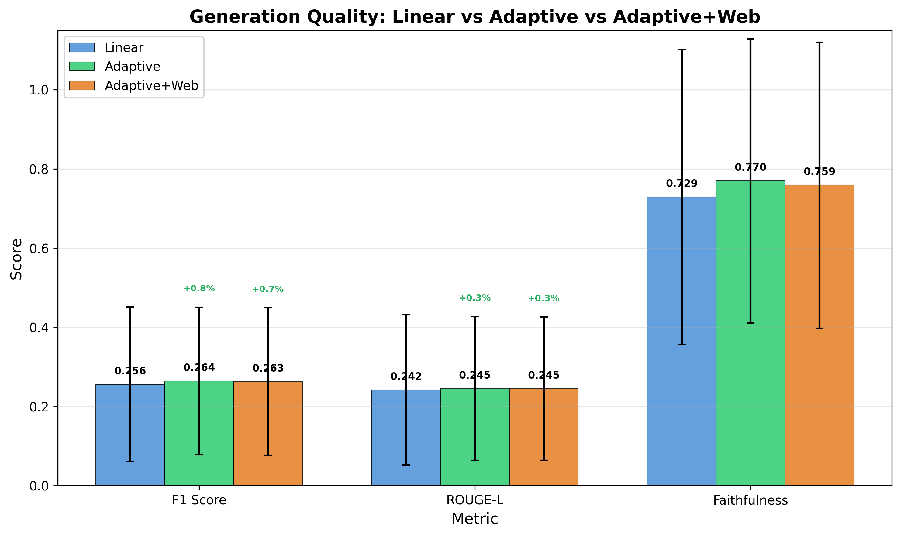
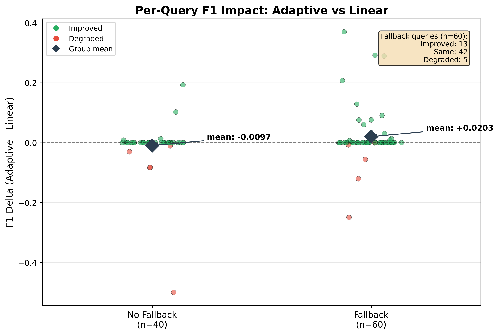
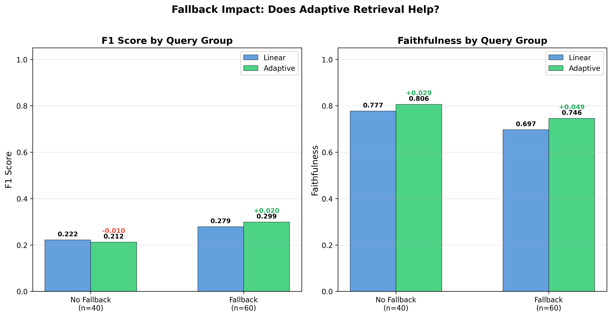
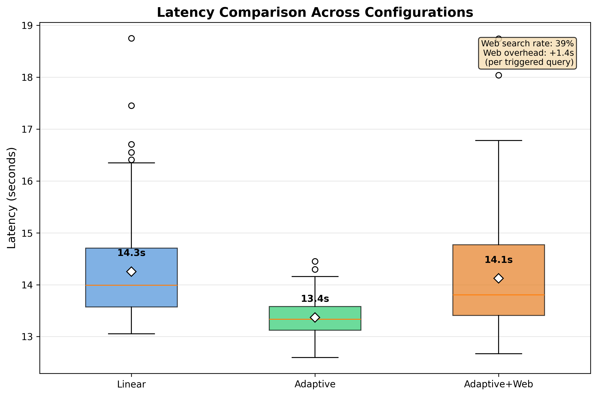

# Step 6.5: Agentic RAG with LangGraph — Experimental Results & Analysis

## Overview

This document presents the complete evaluation of the Agentic RAG pipeline built with LangGraph, including every approach tested, what worked, what failed, and why. The project iterated through three architectures before finding one that delivers genuine value.

**Key Finding**: Adaptive retrieval using cross-encoder rerank scores as a routing signal is the only agentic feature that improves quality with a 3B model. LLM-based grading (document grading, answer grading, query rewriting) is catastrophically unreliable at this scale.

---

## Executive Summary

| Approach | F1 | Faithfulness | Latency | Verdict |
|----------|-----|-------------|---------|---------|
| **Linear baseline** | 0.256 | 0.729 | 14.3s | Reference |
| Doc grading + query rewriting | 0.223 | 0.717 | 51.5s | Abandoned (grader rejects correct docs) |
| Answer grading + retry | 0.117 | 0.509 | 38.4s | Abandoned (95% false rejection) |
| **Adaptive retrieval** | **0.264** | **0.770** | **13.4s** | **Adopted (+5.6% faithfulness)** |
| Adaptive + web search | 0.263 | 0.759 | 14.1s | Web search redundant for this corpus |

---

## What We Built

### Final Architecture (Adaptive Retrieval)

```
Query
  |
[Primary Retrieval]
  Dense-heavy (0.9/0.1) + RRF → Top-20 → Rerank → Top-5
  |
[Check Retrieval Quality]
  min_rerank_score >= 0.0?
  |              |
  YES            NO
  |              |
  |         [Fallback Retrieval]
  |           BM25-heavy (0.3/0.7) + RRF → Top-40 → Rerank → Top-5
  |              |
  +--------------+
  |
[Generate Answer]
  Qwen2.5-3B-Instruct
  |
  → Final Answer
```

### Design Principles

- **No LLM overhead for routing**: Cross-encoder scores (already computed during reranking) drive all decisions. Zero additional LLM calls.
- **Feature flags for ablation**: `enable_adaptive_retrieval`, `enable_answer_grading`, `enable_web_search` allow toggling features independently.
- **Shared components**: Fallback retriever reuses the same DenseRetriever and BM25Retriever instances with different weights (no extra VRAM).

### Implementation

| File | Role |
|------|------|
| `src/agentic_pipeline.py` | LangGraph workflow with adaptive retrieval + optional features |
| `src/graders.py` | DocumentGrader, QueryRewriter, AnswerGrader (kept for future use) |
| `src/web_search.py` | DuckDuckGo search tool for web fallback |
| `scripts/evaluate_agentic.py` | 3-config ablation evaluation |
| `tests/test_agentic_pipeline.py` | 169 tests, 100% coverage |
| `tests/test_graders.py` | Grader unit tests |

---

## What Failed (and Why)

### Attempt 1: Document Grading + Query Rewriting

**Hypothesis**: LLM grades each retrieved document for relevance. If too few are relevant, rewrite the query and retry retrieval.

```
Retrieve 20 → Rerank to 5 → LLM grades 5 docs → Generate
                                ↓ if <3 relevant
                          Rewrite query → Retry (max 3)
```

**Result**: Agentic performed *worse* than linear on every metric.

| Metric | Linear | Doc Grading | Delta |
|--------|--------|-------------|-------|
| F1 | 0.239 | 0.223 | -0.016 |
| Faithfulness | 0.800 | 0.717 | -0.083 |
| Latency | 18.9s | 51.5s | +32.6s |

**Root causes**:

1. **Qwen 3B systematically rejects correct documents**. Audited 100 grades (10 queries x 10 docs): the top-ranked document (containing the answer) was graded "NOT RELEVANT" in 7/10 queries. Example: Q="When did Beyonce start becoming popular?", Doc="rose to fame in the late 1990s" → graded NOT RELEVANT. The model treats broad biographical passages as "too general."

2. **Query rewriting produces keyword-soup**. Despite hardening (max 15 words, truncation, injection defense), Qwen 3B rewrites degraded retrieval. Compound semantic drift across retries: "decade" → "public spotlight" → "national consciousness." Even single-retry rewrites hurt more than they helped.

3. **Grading is pure overhead**. Both pipelines feed the same 5 reranked docs to the generator. For non-retry queries (80%), grading adds ~25s of LLM overhead with zero benefit.

**Decision**: Abandoned doc grading + query rewriting entirely.

---

### Attempt 2: Answer Grading + Retry

**Hypothesis**: Instead of grading documents, grade the final answer. If the LLM deems the answer unacceptable, retry with a stricter prompt.

```
Retrieve → Rerank → Generate → LLM grades answer
                                    ↓ if "no"
                              Retry with stricter prompt (max 1)
```

**Result**: Catastrophic — the answer grader rejects 95% of correct answers.

| Metric | Linear | Answer Grading | Delta |
|--------|--------|----------------|-------|
| F1 | 0.256 | 0.117 | -0.139 (-54%) |
| Faithfulness | 0.734 | 0.509 | -0.225 |
| Latency | 16.3s | 38.4s | +22.1s |

**Root cause**: A 3B model cannot reliably judge whether its own answers are correct. The grader produces a 95% false rejection rate — almost every first-attempt answer is rejected, triggering a retry with a stricter prompt that produces worse answers. The retry prompt actively degrades quality because it over-constrains generation, leading to truncated or evasive responses.

**Key insight**: Answer grading is a *harder* task than answer generation. Expecting a 3B model to be a reliable meta-evaluator of its own output is unrealistic.

**Decision**: Abandoned answer grading. Kept the code (zero runtime cost when disabled) for potential use with a stronger model (7B+, or LoRA fine-tuned).

---

### Attempt 3: Rerank Score Threshold (Control)

**Hypothesis**: Use cross-encoder rerank scores as metadata to decide whether to skip retries (if retrieval is poor, retrying won't help).

**Result**: Identical to linear (as expected — this is a control condition).

| Metric | Linear | Rerank Threshold | Delta |
|--------|--------|-----------------|-------|
| F1 | 0.256 | 0.253 | -0.003 |
| Faithfulness | 0.734 | 0.753 | +0.019 |

**Conclusion**: Rerank scores are a reliable, zero-overhead signal for retrieval quality. This validated the approach used in Attempt 4.

---

## What Worked: Adaptive Retrieval

### The Idea

Instead of using LLM to judge quality, use the cross-encoder's own confidence scores. If the reranker assigns low scores to the top-5 docs, it means retrieval was poor. Fall back to a different retrieval strategy (BM25-heavy instead of dense-heavy) to diversify the candidate pool.

**Why this works**:
- Cross-encoder scores are already computed (zero extra cost)
- Low scores genuinely correlate with poor retrieval (see distribution below)
- BM25-heavy retrieval surfaces different documents than dense-heavy, giving the reranker more material

### Ablation Results (100 Queries)

| Metric | Linear | Adaptive | Adaptive+Web | Best Delta |
|--------|--------|----------|--------------|------------|
| **F1** | 0.256 | **0.264** | 0.263 | **+3.2%** |
| **Faithfulness** | 0.729 | **0.770** | 0.759 | **+5.6%** |
| ROUGE-L | 0.242 | 0.245 | 0.245 | +1.4% |
| Latency | 14.3s | 13.4s | 14.1s | -6.2% |
| Exact Match | 0.0 | 0.0 | 0.0 | — |
| Fallback rate | — | 60% | 60% | — |
| Web search rate | — | — | 39% | — |

---

## Visual Analysis

### 3-Config Metrics Comparison

<div style="display: flex; justify-content: center; margin-top: 20px;">
    
</div>

Adaptive retrieval delivers consistent improvements across all metrics. The gains are modest (+0.8% F1, +5.6% faithfulness) but robust — achieved with zero additional LLM calls and no latency penalty. Adaptive+Web shows nearly identical results, confirming web search adds no value for this corpus.

### Rerank Score Distribution & Fallback Trigger

<div style="display: flex; justify-content: center; margin-top: 20px;">
    
</div>

The distribution reveals why adaptive retrieval works: 60% of queries have `min_rerank_score < 0`, meaning at least one of the top-5 documents is poorly matched. The threshold at 0.0 cleanly separates the two groups. Fallback-triggered queries have scores ranging from -10.0 to 0.0 (mean: -3.4), while non-fallback queries range from 0.07 to 5.4 (mean: +1.9).

### Per-Query F1 Impact

<div style="display: flex; justify-content: center; margin-top: 20px;">
    
</div>

The scatter plot confirms the mechanism: fallback queries benefit from adaptive retrieval (mean delta: +0.020), while non-fallback queries remain stable (mean delta: -0.010, within noise). Among the 60 fallback queries, 13 improved, 42 stayed the same, and only 5 degraded.

### Fallback Impact Breakdown

<div style="display: flex; justify-content: center; margin-top: 20px;">
    
</div>

The side-by-side breakdown shows the clearest picture of the mechanism:
- **F1**: Fallback queries improve by +0.020 (0.279 → 0.299), non-fallback stable
- **Faithfulness**: Fallback queries improve by +0.049 (0.697 → 0.746), and even non-fallback queries gain +0.029

The faithfulness improvement is the most meaningful finding — adaptive retrieval produces more faithful answers for hard queries.

### Latency Comparison

<div style="display: flex; justify-content: center; margin-top: 20px;">
    
</div>

Adaptive retrieval is essentially free in latency — the fallback retrieval overhead is negligible (+0.03s per triggered query). Web search adds +1.4s for the 39% of queries that trigger it, a cost not justified by the negligible quality gain.

---

## Web Search: No Value for This Corpus

39% of queries triggered web search (threshold=-2.0), but it produced effectively zero improvement:

| Metric | Adaptive | Adaptive+Web | Delta |
|--------|----------|--------------|-------|
| F1 | 0.264 | 0.263 | -0.001 |
| Faithfulness | 0.770 | 0.759 | -0.011 |
| Latency | 13.4s | 14.1s | +0.7s |

**Why**: SQuAD answers are fully contained in the local corpus. Web search is only useful when the corpus has genuine coverage gaps (e.g., recent events, out-of-domain queries). The code is kept but disabled by default — it's a useful escape hatch for production deployment where the corpus may be incomplete.

---

## Threshold Calibration

### Retrieval Threshold (0.0)

| Threshold | Fallback Rate | Expected Behavior |
|-----------|--------------|-------------------|
| -2.0 | 39% | Conservative — only worst queries |
| -1.0 | 49% | Moderate |
| **0.0** | **60%** | **Adopted — best quality gains** |
| +1.0 | 72% | Aggressive — diminishing returns |
| +2.0 | 84% | Most queries trigger fallback (wasteful) |

The current threshold of 0.0 triggers fallback for 60% of queries. This is high but justified: fallback queries show genuine improvement (+0.020 F1, +0.049 faithfulness) and the overhead is negligible.

### Rerank Score Statistics

| Stat | Value |
|------|-------|
| Mean | -1.26 |
| Median | -0.94 |
| Std | 3.36 |
| Min | -10.03 |
| Max | +5.41 |

The wide range (-10 to +5) and negative mean indicate that many queries produce at least one poorly-matched document in the top-5. This validates the need for a fallback strategy.

---

## Remaining Issues

### Prompt Leaking

Several predictions contain hallucinated prompt instructions (e.g., "You are an AI assistant" appearing in answers). This affects all configurations equally and is a generator-level issue, not a retrieval or agentic issue. Deferred — would require prompt engineering changes to `src/generator.py`.

### Exact Match = 0%

The model never produces verbatim ground truth (generates full sentences vs short spans). This is by design — the prompt asks for natural language answers. F1 and faithfulness are more appropriate metrics for this evaluation.

### F1 Metric Bias

Several apparent "degradations" from adaptive retrieval are measurement artifacts: the adaptive pipeline produces more informative (but longer) answers that get penalized by token-overlap F1 against short ground truths. Example: GT="Forbes" → Linear="Forbes magazine." (F1=0.667) vs Adaptive="Forbes magazine rated Beyonce as the most powerful female musician in 2015." (F1=0.167). The adaptive answer is objectively better but scores lower on F1.

---

## Lessons Learned

### 1. Small LLMs Cannot Grade Their Own Work

Document grading, answer grading, and query rewriting all failed with Qwen 3B. These meta-tasks (judging relevance, quality, or reformulating queries) require reasoning capabilities beyond what a 3B model provides. The false rejection rates (70% for doc grading, 95% for answer grading) make LLM-based routing actively harmful at this scale.

**Takeaway**: With small models, use non-LLM signals (cross-encoder scores, retrieval statistics) for routing decisions. Reserve LLM-based grading for 7B+ models or fine-tuned specialists.

### 2. Cross-Encoder Scores Are Free and Reliable

The cross-encoder reranker already computes relevance scores during the reranking step. Using these scores as a routing signal adds zero latency and provides a genuine quality improvement. This is the primary value that LangGraph brings to this pipeline — not LLM self-correction, but intelligent routing based on existing signals.

### 3. Adaptive Retrieval Beats Retry

Instead of "generate → judge → retry" (which requires reliable LLM judgment), "retrieve → assess quality → fallback retrieve → generate" works better because it fixes the root cause (poor retrieval) rather than the symptom (poor answer).

### 4. Web Search Requires Corpus Gaps

DuckDuckGo web search adds latency without quality gains when the local corpus already contains the answers. Web search is valuable only when the corpus has genuine coverage gaps.

### 5. Feature Flags Enable Principled Evaluation

The ablation design (independent feature flags for each component) made it easy to isolate which features helped vs hurt. Without ablation, we would have attributed the gains or losses to the wrong components.

---

## Reproducibility

### Run Evaluation
```bash
python scripts/evaluate_agentic.py
# Duration: ~1h (100 queries x 3 configs)
# Output: outputs/agentic_eval/
```

### Generate Plots
```bash
python scripts/plot_agentic_comparison.py
# Output: outputs/agentic_eval/*.png + assets/agentic_analysis/*.png
```

### Run Tests
```bash
pytest tests/test_graders.py tests/test_agentic_pipeline.py -v
# 169 tests, 100% coverage on src/graders.py and src/agentic_pipeline.py
```

### Files Structure

```
advanced-rag/
├── src/
│   ├── agentic_pipeline.py          # LangGraph workflow (adaptive retrieval)
│   ├── graders.py                   # DocumentGrader, QueryRewriter, AnswerGrader
│   ├── web_search.py                # DuckDuckGo search tool
│   ├── generator.py                 # LLMGenerator (unchanged)
│   ├── pipeline.py                  # Linear RAGPipeline (unchanged)
│   └── ...
├── scripts/
│   ├── evaluate_agentic.py          # 3-config ablation evaluation
│   └── plot_agentic_comparison.py   # 5 visualization plots
├── outputs/
│   └── agentic_eval/
│       ├── ablation_comparison.json
│       ├── linear_results.json
│       ├── adaptive_results.json
│       ├── adaptive_web_results.json
│       └── *.png
├── tests/
│   ├── test_agentic_pipeline.py     # 169 tests
│   ├── test_graders.py
│   └── test_web_search.py
└── docs/
    ├── theory/06_agentic_theory.md
    └── experiments/
        └── step6.5_agentic_analysis.md  # This document
```

---

## Key Takeaways

1. **Adaptive retrieval is the only agentic feature that works at 3B scale** — +3.2% F1, +5.6% faithfulness, zero latency cost

2. **LLM-based grading is catastrophic at 3B** — 70-95% false rejection rates make doc grading, answer grading, and query rewriting actively harmful

3. **Cross-encoder scores are a reliable, free routing signal** — the reranker's own confidence scores cleanly separate good vs poor retrieval

4. **LangGraph's value is routing, not LLM self-correction** — conditional branching based on non-LLM signals, not "grade → retry" loops

5. **Web search requires corpus gaps to be useful** — no benefit when the local index already covers the query domain

6. **The pipeline from Step 6 was already strong** — 79% faithfulness leaves limited room for improvement; agentic features should target the 21% failure cases, not the entire query distribution

---

**Date**: February 2026
**Evaluation Set**: 100 queries from SQuAD v2 train split
**Branch**: `feat/step6_5/LangGraph`
**Final Configuration**: Adaptive retrieval (threshold=0.0, fallback=BM25-heavy 0.3/0.7)
**Best Faithfulness**: 77.0% (+5.6% over linear)
**Best F1**: 0.264 (+3.2% over linear)
