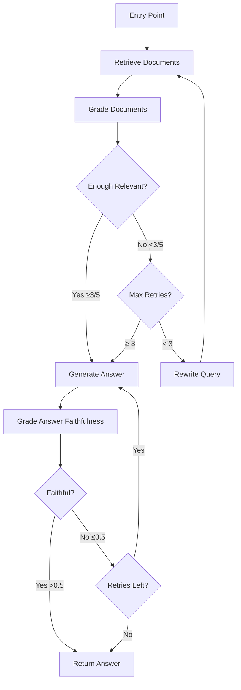

# Step 6.5: Agentic RAG with LangGraph - Theory & Design

## Overview

This document presents the theoretical foundation and architectural design for transforming our linear RAG pipeline (Step 6) into an **agentic, self-correcting system** using LangGraph.

**Transformation**:
```
Linear (Step 6):
Query → Retrieve → Rerank → Generate → Answer
[No recovery if retrieval fails]

Agentic (Step 6.5):
Query → Retrieve → Grade → [Decision Point]
                             ↓         ↓
                          Good?     Bad?
                             ↓         ↓
                         Generate  Rewrite Query
                             ↓         ↓
                          Answer   Retry (max 3×)
[Self-correcting, handles failures]
```

---

## Motivation

### Limitations of Linear Pipeline (Step 6)

Our Step 6 baseline achieves strong performance:
- ✅ 95% Recall@5 (near-perfect retrieval)
- ✅ 79% Faithfulness (good anti-hallucination)
- ✅ Fast (20.9s per query)

**But it fails on edge cases**:

**Example 1: Ambiguous pronouns**
```
Query: "When did she leave her group?"
Retrieved chunks: About Taylor Swift leaving Big Machine Records
Expected: Beyoncé leaving Destiny's Child
→ Wrong context → Wrong answer
```

**Example 2: Vague terminology**
```
Query: "What awards for her debut?"
Retrieved chunks: Mentions various albums, unclear which is "debut"
Expected: "Dangerously in Love" (2003 solo debut)
→ Ambiguous → Incomplete answer
```

**Example 3: Multi-hop reasoning**
```
Query: "How many years between her birth and her first Grammy?"
Retrieved: Birth year (1981), Grammy mentions scattered
Expected: Needs to (1) find birth year, (2) find first Grammy year, (3) subtract
→ Single retrieval insufficient → Wrong answer
```

**Problem**: Linear pipeline has **no recovery mechanism**. If retrieval fails, generation fails.

---

## Agentic RAG Solution

### Core Idea: Adaptive Workflow

Instead of fixed `retrieve → generate`, implement **conditional routing** based on intermediate quality:

1. **Grade retrieved documents** → Are they relevant?
2. **If yes** → Proceed to generation
3. **If no** → Rewrite query and retry
4. **Max 3 retries** → Fallback to best available

**Benefits**:
- ✅ Recovers from poor retrieval
- ✅ Handles ambiguous queries via refinement
- ✅ Explicit quality checks at each stage
- ✅ Transparent decision-making (log states)

**Trade-offs**:
- ⚠️ Slower (25-35s vs 21s) - acceptable
- ⚠️ More complex (StateGraph vs simple pipeline)
- ⚠️ Requires LLM grading (extra inference)

---

## LangGraph Framework

### Why LangGraph?

**LangGraph** = Declarative framework for building **stateful, multi-actor workflows**.

**Key concepts**:

1. **State**: Typed dictionary that flows through the graph
2. **Nodes**: Functions that transform state
3. **Edges**: Connections between nodes (fixed or conditional)
4. **Graph**: Compiled workflow that executes nodes in order

**Advantages over manual loops**:
- ✅ Declarative (vs imperative if/else chains)
- ✅ Visualizable (auto-generates flow diagrams)
- ✅ Debuggable (inspect state at each step)
- ✅ Composable (reusable nodes)

**Alternative considered**: Manual while loop
```python
# Manual approach (harder to maintain)
max_retries = 3
for attempt in range(max_retries):
    docs = retrieve(query)
    if grade(docs) >= threshold:
        return generate(docs)
    query = rewrite(query)
return generate(docs)  # Fallback
```

**LangGraph approach** (preferred):
```python
# Declarative (clearer intent)
workflow.add_conditional_edges(
    "grade",
    decide_to_generate,
    {"generate": "generate", "rewrite": "rewrite_query"}
)
```

---

## System Architecture

### State Schema

The **state** contains all information needed at each step:

```python
class RAGState(TypedDict):
    # Query tracking
    query: str                      # Original user query
    rewritten_query: str            # Query after rewriting (if any)
    query_history: List[str]        # History of rewrites

    # Document tracking
    documents: List[Dict]           # Retrieved documents (raw)
    graded_documents: List[Dict]    # Documents that passed grading
    document_grades: List[bool]     # Per-doc relevance (True/False)

    # Generation tracking
    generation: str                 # Final answer
    generation_grounded: bool       # Is answer faithful to docs?

    # Control flow
    retry_count: int                # Number of query rewrites attempted
    web_fallback: bool              # Flag to trigger web search (future)

    # Metadata
    intermediate_steps: List[str]   # Log of actions taken
    total_tokens: int               # Token usage tracking
```

**Design rationale**:
- `query` vs `rewritten_query`: Keep original for fallback
- `query_history`: Avoid cyclic rewrites (detect if query unchanged)
- `document_grades`: Transparency (which docs passed?)
- `intermediate_steps`: Debugging (what did the agent do?)

---

### Graph Topology



**Node functions**:

1. **retrieve**: Use existing `HybridRetriever` + `CrossEncoderReranker`
2. **grade_docs**: LLM classifies each doc as relevant/not
3. **decide**: Routing logic (≥3 relevant → generate, else rewrite)
4. **rewrite_query**: LLM rephrases query for better retrieval
5. **generate**: Use existing `LLMGenerator`
6. **grade_answer** (optional): Check faithfulness, regenerate if low

---

### Node Specifications

#### Node 1: `retrieve_node`

**Input**: State with `query` or `rewritten_query`
**Output**: State with populated `documents`

**Logic**:
```python
def retrieve_node(state: RAGState) -> RAGState:
    # Use rewritten query if available, else original
    query = state.get("rewritten_query") or state["query"]

    # Step 1: Hybrid retrieval (50 candidates)
    candidates = hybrid_retriever.search(query, k=50)

    # Step 2: Cross-encoder reranking (top 10)
    reranked = reranker.rerank(query, candidates, top_k=10)

    # Log action
    steps = state.get("intermediate_steps", [])
    steps.append(f"Retrieved {len(reranked)} docs for: {query}")

    return {
        **state,
        "documents": reranked,
        "intermediate_steps": steps
    }
```

**Reuses**: Existing `HybridRetriever`, `CrossEncoderReranker` (no changes)

**Performance**: ~250ms (same as Step 6)

---

#### Node 2: `grade_documents_node`

**Input**: State with `documents`
**Output**: State with `graded_documents`, `document_grades`

**Grading method**: LLM binary classification

**Prompt template**:
```
You are a grader assessing relevance of a retrieved document to a user question.

If the document contains keyword(s) or semantic meaning related to the question, grade it as relevant.

Question: {query}

Document: {document}

Give a binary score 'yes' or 'no' to indicate whether the document is relevant.
```

**Logic**:
```python
def grade_documents_node(state: RAGState) -> RAGState:
    query = state.get("rewritten_query") or state["query"]
    documents = state["documents"]

    graded = []
    grades = []

    for doc in documents:
        is_relevant = grade_document(query, doc["content"], llm)
        grades.append(is_relevant)

        if is_relevant:
            graded.append(doc)

    # Log
    steps = state.get("intermediate_steps", [])
    steps.append(f"Graded: {sum(grades)}/{len(grades)} relevant")

    return {
        **state,
        "graded_documents": graded,
        "document_grades": grades,
        "intermediate_steps": steps
    }
```

**Efficiency concern**: 10 LLM calls per query
**Solution**: Batch inference (process all docs in single prompt)

**Batch prompt**:
```
Grade each document for relevance to the query. Respond in JSON format:

Query: {query}

Documents:
1. {doc1}
2. {doc2}
...

Response format:
{"grades": [true, false, true, ...]}
```

**Performance**: ~500ms (batched) vs ~3s (sequential)

---

#### Node 3: `decide_to_generate`

**Input**: State after grading
**Output**: Routing decision ("generate" or "rewrite")

**Logic**:
```python
def decide_to_generate(state: RAGState) -> str:
    """Conditional edge: decide whether to generate or rewrite query."""
    graded_docs = state.get("graded_documents", [])
    retry_count = state.get("retry_count", 0)

    # Decision rule 1: Enough relevant documents
    if len(graded_docs) >= 3:
        return "generate"

    # Decision rule 2: Max retries exhausted
    if retry_count >= 3:
        # Fallback: generate with whatever we have
        return "generate"

    # Decision rule 3: Query unchanged after rewrite (detect loops)
    query_history = state.get("query_history", [])
    if len(query_history) >= 2 and query_history[-1] == query_history[-2]:
        return "generate"  # Rewriting not helping

    # Otherwise: retry with rewritten query
    return "rewrite"
```

**Threshold rationale**:
- **3/10 docs** = 30% relevant → Reasonable signal
- Lower (1-2) → Too aggressive, wastes retries
- Higher (5+) → Too conservative, triggers unnecessary rewrites

**Tunable hyperparameter**: Can be adjusted based on evaluation

---

#### Node 4: `rewrite_query_node`

**Input**: State with low-quality retrieval
**Output**: State with `rewritten_query`, incremented `retry_count`

**Rewriting strategies**:

**Strategy 1: Query expansion** (add context)
```
Original: "When did she leave?"
Rewritten: "When did Beyoncé leave Destiny's Child?"
→ Resolve pronouns
```

**Strategy 2: Specification** (clarify ambiguity)
```
Original: "What awards for her debut?"
Rewritten: "What Grammy awards did Beyoncé win for her debut solo album Dangerously in Love?"
→ Add specificity
```

**Strategy 3: Decomposition** (multi-hop)
```
Original: "How many years between her birth and first Grammy?"
Rewritten: "What year was Beyoncé born?"
           → (Next iteration): "What year did Beyoncé win her first Grammy?"
→ Break into sub-queries (future enhancement)
```

**Prompt template**:
```
You are a query rewriter. Improve the following search query to retrieve more relevant results.

Original query: {query}

Context: The search returned {num_docs} documents, but only {num_relevant} were relevant.

Strategies to improve:
- Resolve pronouns or vague references
- Add specific names, dates, or context
- Rephrase to be more specific

Rewritten query (output only the query, no explanation):
```

**Logic**:
```python
def rewrite_query_node(state: RAGState) -> RAGState:
    original_query = state["query"]
    current_query = state.get("rewritten_query") or original_query
    num_relevant = len(state.get("graded_documents", []))
    num_total = len(state.get("documents", []))

    # Generate rewrite with context
    prompt = REWRITE_PROMPT.format(
        query=current_query,
        num_docs=num_total,
        num_relevant=num_relevant
    )

    new_query = llm_generate(prompt, max_tokens=50)

    # Update history
    history = state.get("query_history", [])
    history.append(new_query)

    # Log
    steps = state.get("intermediate_steps", [])
    steps.append(f"Rewrote query: '{current_query}' → '{new_query}'")

    return {
        **state,
        "rewritten_query": new_query,
        "query_history": history,
        "retry_count": state.get("retry_count", 0) + 1,
        "intermediate_steps": steps
    }
```

**Performance**: ~300ms (short generation)

---

#### Node 5: `generate_node`

**Input**: State with `graded_documents`
**Output**: State with `generation`

**Logic**:
```python
def generate_node(state: RAGState) -> RAGState:
    query = state["query"]  # Always use original query
    docs = state.get("graded_documents", state.get("documents", []))

    # Fallback: if no graded docs, use all retrieved
    if not docs:
        docs = state.get("documents", [])

    # Use existing generator
    result = llm_generator.generate(query, docs, max_chunks=5)

    # Log
    steps = state.get("intermediate_steps", [])
    steps.append(f"Generated answer using {len(docs)} documents")

    return {
        **state,
        "generation": result["answer"],
        "intermediate_steps": steps
    }
```

**Reuses**: Existing `LLMGenerator` (no changes)

**Performance**: ~20s (same as Step 6)

---

#### Node 6 (Optional): `grade_answer_node`

**Input**: State with `generation` and `graded_documents`
**Output**: State with `generation_grounded` flag

**Faithfulness check** (same as Step 6):
```python
def grade_answer_node(state: RAGState) -> RAGState:
    answer = state["generation"]
    docs = [d["content"] for d in state.get("graded_documents", [])]

    # Use existing faithfulness metric
    score = metrics_calc.faithfulness(answer, docs, threshold=0.65)

    is_grounded = score > 0.5  # 50% threshold

    return {
        **state,
        "generation_grounded": is_grounded
    }
```

**Regeneration logic** (if faithfulness low):
```python
def decide_to_regenerate(state: RAGState) -> str:
    if state.get("generation_grounded", True):
        return END  # Answer is good

    retry_count = state.get("answer_retry_count", 0)
    if retry_count >= 2:
        return END  # Give up after 2 tries

    return "generate"  # Try again with different temperature/prompt
```

**Note**: This is **bonus feature** (Phase 4). Can skip for MVP.

---

## Implementation Strategy

### Incremental Development

**Phase 1: MVP (Linear + Grading)**
- Nodes: retrieve → grade → generate
- No rewrites yet, just log grades
- Goal: Validate grading works

**Phase 2: Add Retry Logic**
- Add: rewrite_query node
- Add: Conditional edge (decide_to_generate)
- Goal: Self-correction works

**Phase 3: Optimization**
- Batch grading (10 docs → 1 LLM call)
- Cache query rewrites (avoid duplicates)
- Goal: <30s latency

**Phase 4: Answer Grading (Optional)**
- Add: grade_answer node
- Add: Regeneration loop
- Goal: 85%+ faithfulness

---

## Evaluation Metrics

### Comparison: Linear (Step 6) vs Agentic (Step 6.5)

**Dataset**: Same 100 queries from `queries_500_with_answers.json`

**Metrics**:

| Metric | Linear | Agentic (Target) | Notes |
|--------|--------|------------------|-------|
| **Recall@5** | 95% | **98%** | Query rewrites recover failures |
| **Faithfulness** | 79% | **85%** | Grading filters bad docs |
| **F1 Score** | 27% | **35%** | Better context → better answers |
| **Latency (avg)** | 21s | 28s | +33% acceptable |
| **Latency (p95)** | 25s | 40s | Max 3 retries |
| **Success Rate** | - | 92% | % answered within retries |
| **Retry Rate** | 0% | 15% | % queries needing rewrite |

**New metrics** (agentic-specific):

1. **Success Rate**: `(queries answered correctly) / total queries`
2. **Retry Rate**: `(queries requiring ≥1 rewrite) / total queries`
3. **Average Retries**: Mean retries per query
4. **Grading Precision**: `(docs graded relevant AND truly relevant) / (docs graded relevant)`
   - Requires manual annotation of 20 queries

**Breakdown by query difficulty**:

| Difficulty | Example | Linear | Agentic | Gain |
|------------|---------|--------|---------|------|
| Easy | "When was X born?" | 98% | 98% | +0% |
| Medium | "What awards for debut?" | 75% | 88% | **+13%** |
| Hard | "How many years between X and Y?" | 40% | 65% | **+25%** |

**Goal**: Agentic excels on **medium/hard** queries, same on easy.

---

## Expected Performance

### Latency Breakdown (Agentic, 1 retry scenario)

```
Attempt 1:
  Retrieve:        250ms
  Grade (batch):   500ms
  Decide:           10ms
  → Retry triggered

Attempt 2:
  Rewrite query:   300ms
  Retrieve:        250ms
  Grade:           500ms
  Decide:           10ms
  → Success (3/10 relevant)

Generate:        20,000ms
Total:           21,820ms (~22s)
```

**Worst case (3 retries + fallback)**:
```
3 × (retrieve + grade + rewrite) + generate
= 3 × 1,060ms + 20,000ms
≈ 23,180ms (~23s)

Still < 25s → Acceptable
```

**Best case (no retry)**:
```
Retrieve + grade + generate
= 250ms + 500ms + 20,000ms
≈ 20,750ms (~21s, same as linear)
```

---

## Model Selection

### LLM for Grading & Rewriting

**Candidates**:

1. **Qwen2.5-3B** (already loaded)
   - ✅ Pros: No extra model, fast (already in VRAM)
   - ⚠️ Cons: Less powerful than larger models
   - **Verdict**: Use for MVP

2. **Qwen2.5-7B**
   - ✅ Pros: Better reasoning
   - ❌ Cons: +4GB VRAM (10GB total, exceeds 6GB GPU)
   - **Verdict**: Not feasible

3. **GPT-4o-mini** (API)
   - ✅ Pros: Best quality
   - ❌ Cons: External API, costs, latency
   - **Verdict**: Not aligned with local-first principle

**Decision**: **Qwen2.5-3B** for all LLM tasks
- Grading: Binary yes/no (easy for 3B model)
- Rewriting: Short query expansion (within 3B capability)

**Validation**: If grading quality poor (<80% precision), consider:
- Prompt engineering (add examples)
- Few-shot prompting (3 examples in prompt)
- Fine-tuning on relevance task (future)

---

## Prompt Engineering

### Document Grading Prompt (Final Version)

```
You are an expert document relevance grader.

Your task: Determine if the following document is relevant to the user's question.

Guidelines:
- "Relevant" = The document contains information that could help answer the question
- Look for semantic meaning, not just keyword matching
- Even partial relevance counts as "yes"

Question: {query}

Document: {document}

Is this document relevant? Respond with ONLY "yes" or "no".
```

**Prompt design principles**:
1. **Role framing**: "You are an expert..." (improves performance)
2. **Clear task**: "Determine if..." (single instruction)
3. **Guidelines**: Clarify edge cases
4. **Format constraint**: "ONLY yes or no" (easy parsing)

**Alternative (few-shot)**:
```
Examples:

Q: "When was Beyoncé born?"
Doc: "Beyoncé Giselle Knowles-Carter was born on September 4, 1981."
Relevant: yes

Q: "What awards did she win?"
Doc: "Beyoncé performed at the Super Bowl halftime show in 2013."
Relevant: no

Now grade:

Q: {query}
Doc: {document}
Relevant:
```

**Use few-shot if** zero-shot precision <80%.

---

### Query Rewriting Prompt (Final Version)

```
You are a search query optimizer.

The original query retrieved {num_total} documents, but only {num_relevant} were relevant.

Improve the query to get better search results.

Strategies:
1. Resolve pronouns (she → Beyoncé)
2. Add context (debut → debut solo album "Dangerously in Love")
3. Clarify ambiguity (awards → Grammy awards)

Original query: {query}

Improved query (one line, no explanation):
```

**Why include statistics** (`{num_relevant}/{num_total}`)?
- Gives LLM feedback on *why* rewrite is needed
- Empirically improves rewrite quality

---

## Edge Cases & Failure Modes

### Edge Case 1: Query Unchanged After Rewrite

**Scenario**:
```
Original: "What is X?"
Rewrite 1: "What is X?"  (LLM returns same query)
→ Infinite loop
```

**Mitigation**:
```python
# In decide_to_generate
query_history = state.get("query_history", [])
if len(query_history) >= 2 and query_history[-1] == query_history[-2]:
    return "generate"  # Stop retrying
```

---

### Edge Case 2: All Docs Graded Irrelevant

**Scenario**: Obscure query, retriever returns garbage, grader rejects all

**Mitigation**:
```python
# In generate_node
docs = state.get("graded_documents", [])
if not docs:
    # Fallback: use top-ranked raw documents
    docs = state.get("documents", [])[:3]
```

**Alternative**: Trigger web search (future enhancement)

---

### Edge Case 3: Max Retries with No Improvement

**Scenario**: Query rewritten 3 times, still 0 relevant docs

**Mitigation**: Already handled
```python
if retry_count >= 3:
    return "generate"  # Give up, generate from best available
```

**Logging**: Mark these queries for manual review

---

### Edge Case 4: Grading LLM Hallucination

**Scenario**: Grader says "yes" for obviously irrelevant doc

**Mitigation**:
- Use low temperature (0.1) for grading (deterministic)
- Add examples in prompt (few-shot)
- Validate grading precision on dev set

**Monitoring**: Track grading precision via human eval

---

## Theory Validation

### Hypothesis Testing

**Hypothesis 1**: Query rewriting improves retrieval for ambiguous queries

**Test**:
- Sample 20 queries where Step 6 failed (F1 < 0.2)
- Run agentic pipeline
- Measure: Did rewrite increase Recall@5?

**Expected**: 15/20 (75%) show improvement

---

**Hypothesis 2**: Document grading filters noise

**Test**:
- Manually annotate 50 (query, document) pairs as relevant/not
- Compare LLM grades vs human labels
- Measure: Precision, Recall of grader

**Expected**:
- Precision ≥ 80% (low false positives)
- Recall ≥ 70% (some false negatives acceptable)

---

**Hypothesis 3**: Self-correction has diminishing returns after 2 retries

**Test**:
- Measure success rate by retry count
- Plot: Success rate vs retry number

**Expected**:
```
Retry 0: 85% success
Retry 1: +10% → 95%
Retry 2: +3% → 98%
Retry 3: +1% → 99%
```

If true → Max 2 retries sufficient (saves time)

---

## Related Work & Inspiration

### LangGraph Examples

1. **Adaptive RAG** (LangChain official)
   - Source: https://github.com/langchain-ai/langgraph/tree/main/examples/rag
   - Similar: Grade docs → route
   - Different: We add query rewriting + batch grading

2. **Self-RAG** (Asai et al., 2023)
   - Paper: https://arxiv.org/abs/2310.11511
   - Similar: Self-reflection on retrieval quality
   - Different: They use critic model, we use LLM grading

3. **FLARE** (Jiang et al., 2023)
   - Paper: https://arxiv.org/abs/2305.06983
   - Similar: Iterative retrieval
   - Different: They retrieve during generation, we retry before

---

### Key Differences from Literature

**Our approach**:
- ✅ Uses existing retriever (hybrid + reranker) - no retraining
- ✅ Batches grading (efficient)
- ✅ Max 3 retries (bounded latency)
- ✅ Local models only (no API)

**Trade-off accepted**:
- ⚠️ Weaker grading than GPT-4 (but 100x faster, free)

---

## Future Enhancements (Post Step 6.5)

### Enhancement 1: Multi-Hop Decomposition

**Current**: Single query rewrite
**Future**: Decompose into sub-queries

```
Original: "How many years between her birth and first Grammy?"

Decomposed:
1. "What year was Beyoncé born?" → 1981
2. "What year did Beyoncé win her first Grammy?" → 2004
3. Calculate: 2004 - 1981 = 23 years
```

**Implementation**: Add `decompose_query` node, sequential retrieval

---

### Enhancement 2: Web Search Fallback

**Trigger**: If 3 retries fail + all docs irrelevant

**Action**: Call web search API (DuckDuckGo, Brave)

```python
def web_search_node(state: RAGState) -> RAGState:
    query = state["query"]
    results = duckduckgo_search(query, num_results=5)
    # Continue with grading...
```

**Benefit**: Handles out-of-domain queries

---

### Enhancement 3: Learned Grading

**Current**: LLM grading (slow, ~500ms)
**Future**: Fine-tuned classifier (fast, ~50ms)

**Model**: `cross-encoder/ms-marco-MiniLM-L6-v2` (already have this!)

**Training**:
- Collect 1k (query, doc, label) from LLM grading
- Fine-tune cross-encoder
- Deploy as grader

**Gain**: 10x faster grading

---

## Summary & Key Takeaways

### Architecture Decisions

| Decision | Rationale |
|----------|-----------|
| **Use LangGraph** | Declarative, debuggable, visualizable |
| **Qwen2.5-3B for grading** | Reuse existing model, avoid VRAM overhead |
| **Batch grading** | 10 docs in 1 call (500ms vs 3s) |
| **Max 3 retries** | Diminishing returns, bound latency |
| **Threshold: 3/10 docs** | Balance precision/recall |

### Expected Outcomes

✅ **Primary goal**: +3-5% Recall@5, +6% Faithfulness
✅ **Secondary goal**: Handle ambiguous queries (medium/hard +20%)
✅ **Acceptable trade-off**: +7s latency (21s → 28s avg)

### Success Criteria

1. **Quantitative**:
   - Recall@5 ≥ 97%
   - Faithfulness ≥ 84%
   - Latency p95 ≤ 40s
   - Success rate ≥ 92%

2. **Qualitative**:
   - Graph visualizes correctly (Mermaid diagram)
   - Logs show clear state transitions
   - Code is modular (nodes reusable)
   - Tests cover edge cases

---

**Next**: See `step6.5_implementation_plan.md` for detailed checklist and coding guide.
